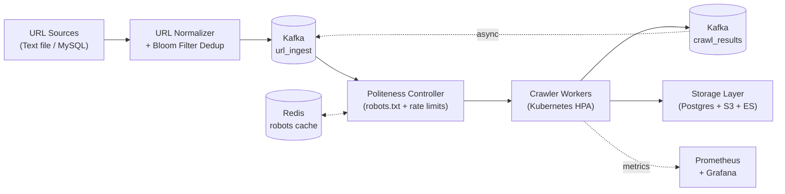
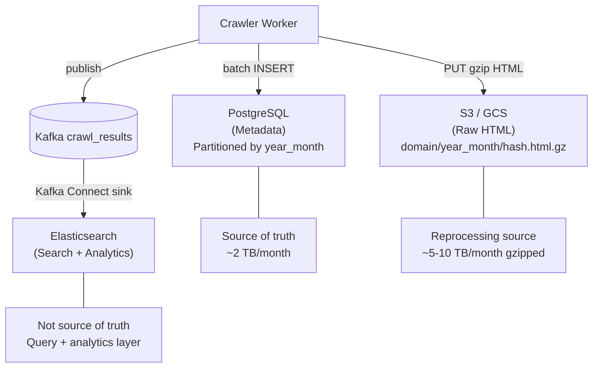

# Architecture Diagrams

Two diagrams are provided — one for the overall system, one for the storage layer.

## Files

| File | Diagram |
|------|---------|
| `arch_diagram_1_system_overview.excalidraw` | Full system: ingest → Kafka → politeness → workers → storage → monitoring |
| `arch_diagram_2_storage_layer.excalidraw` | Storage tier breakdown: PostgreSQL, S3, Elasticsearch |

---

## How to Open in Excalidraw (recommended)

1. Go to **https://excalidraw.com**
2. Click the **folder icon** (top left) → **Open**
3. Select the `.excalidraw` file from your computer
4. The diagram loads with full editing capability
5. To export as PNG: **Menu → Export image → PNG** (set scale to 3x for high-res)

---

## How to Add Diagrams to Google Docs

**Option A — PNG embed (cleanest)**
1. Export diagrams as PNG from Excalidraw (see above)
2. In your Google Doc: **Insert → Image → Upload from computer**
3. Place the image in the doc where needed

**Option B — Diagrams.net Google Docs add-on (editable in-doc)**
1. In Google Docs: **Extensions → Add-ons → Get add-ons**
2. Search for **"Diagrams.net"** and install it
3. You can then insert and edit diagrams directly in the doc
4. Note: you'd need to recreate the diagrams in draw.io format, but the Excalidraw
   PNG exports look great embedded as images

---

## Alternative: Mermaid (for quick rendering)

If you want to render a diagram without Excalidraw, paste the Mermaid code below
at **https://mermaid.live** and export as SVG or PNG.

### Diagram 1 — System Architecture

### Diagram 2 — Storage Layer

